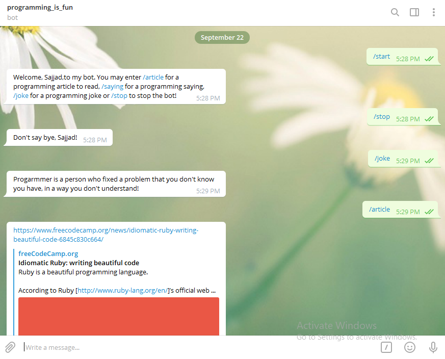

Microverse Capstone Project

## Telegram Bot(Programmer_buddy)

- This is Telegram Bot implemented using Ruby And [Telegram bot API](https://core.telegram.org/bots/api)
- You need to have a Telegram app installed on your machine to run this Bot. Install it using this [Link](https://desktop.telegram.org/)
- Once you have application, now you can search for 'programmer_buddy', which is my Bot name.
- This bot accepts a few commands and return you an article about programming, a saying or joke about programming.

# Rspec Tests


- Rspec tests are in these files: jokes_spec.rb, sayings_spec.rb, articles_spec.rb and reuse_spec.rb in spec directory.
- Tests can be found for below mentioned instance methods.

- '#initialize' for Jokes
- '#initialize' for Sayings
- '#initialize' for Articles
- '#random_joke'
- '#random_saying'
- '#random_article'
- '#rand_string'

- Tests can be run using rspec or rspec --format documentation command
- Screenshot of passing spec is attached above



This Bot has five commands

- [x] /start - It gives the information that how to use othe commands to get the desired info.
- [x] /stop  - It says "Don't say bye, your name!".
- [x] /article - It gives you a random article related to any topic of programming.
- [x] /joke - It displays a random joke related to programming.
- [x] /saying - It displays a random saying related to programming.

# How To Use Prgrammer_buddy

- You can clone this [Repo](https://github.com/SajjadAhmad14/Telegram-bot) to have code for this app in your machine
- You must have a Telegram app to run this Bot
- Use above mentioned commands to play with Bot

## Built With

- Ruby
- Telegram API
- Dotenv
- Rubocop
- Rspec
- VsCode

## Getting Started

To get a local copy up and running follow these simple example steps.
- Go to this [Link](https://github.com/SajjadAhmad14/Telegram-bot) and clone or fork the repository
- Open it in your favourite code editor
- Run the code and do let me know if you have any idea to improve the code or a add a feature

### Install

In order to run, you need to install RUBY in your computer. For windows you can go to [Ruby installer](https://rubyinstaller.org/) and for MAC and LINUX you can go to [Ruby official site](https://www.ruby-lang.org/en/downloads/) for intructions on how to intall it.
Then you can clone the project by typing ```git clone https://github.com/RaminMammadzada/ruby-tic-tac-toe-game/tree/develop```

## Authors

👤 **Sajjad Ahmad**

- Github: [@githubhandle](https://github.com/SajjadAhmad14)
- Twitter: [@twitterhandle](https://twitter.com/Sajjad_Ahmad14)
- Linkedin: [linkedin](https://linkedin.com/sajjad-ahmad-86102117a/)

## 🤝 Contributing

- If you want to contribute or have a feature to add.
- Go to the repo
- Open a pull request

Contributions, issues and feature requests are welcome!

Feel free to check the [issues page](https://github.com/SajjadAhmad14/Telegram-bot/issues).

## Show your support

Give a ⭐️ if you like this project!

## Acknowledgments

- Microverse
